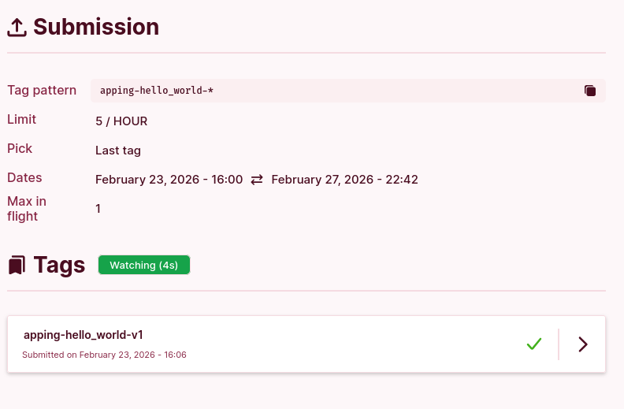

# Epita Moulinette Notifs

A Tampermonkey userscript that sends desktop notifications when moulinette tags
are processed on the [EPITA Forge intranet](https://intra.forge.epita.fr).

Stop refreshing the page — let the page watch for you.

## How it works

1. On any project page with a **Tags** section, a **Watch** button appears.
2. Click it to start watching. The script polls silently in the background every
   5 seconds — no page reloads.
3. When new tags finish processing, you get desktop notifications with the
   project name, tag name, and success percentage.
4. The button shows a live countdown to the next poll.
5. Already-notified tags are remembered so you won't get duplicate alerts.
6. Auto-updates via Tampermonkey when a new version is pushed.

## Installation

### 1. Install Tampermonkey

Tampermonkey is a browser extension that lets you run userscripts on any website.

| Browser | Link |
|---------|------|
| Chrome  | [Chrome Web Store](https://chrome.google.com/webstore/detail/tampermonkey/dhdgffkkebhmkfjojejmpbldmpobfkfo) |
| Firefox | [Firefox Add-ons](https://addons.mozilla.org/firefox/addon/tampermonkey/) |
| Edge    | [Edge Add-ons](https://microsoftedge.microsoft.com/addons/detail/tampermonkey/iikmkjmpaadaobahmlepeloendndfphd) |
| Safari  | [Mac App Store](https://apps.apple.com/app/tampermonkey/id1482490089) |

### 2. Install the script

Click the link below — Tampermonkey will open an install prompt automatically:

**[Install epita-moulinette-notifs.user.js](https://github.com/KazeTachinuu/epita-moulinette-notifs/raw/master/epita-moulinette-notifs.user.js)**

> If the install prompt doesn't appear, you can install manually:
> 1. Open the Tampermonkey dashboard (click the extension icon → **Dashboard**)
> 2. Go to the **Utilities** tab
> 3. Paste the raw script URL in **Install from URL** and click **Install**

### 3. Allow notifications

The first time a tag is processed, your browser will ask for notification
permissions. Click **Allow** — otherwise the script can't notify you.

### 4. Use it

Navigate to any project page on `intra.forge.epita.fr` that has a **Tags**
section. You'll see a **Watch** button. Click it and you're set.

## License

MIT
